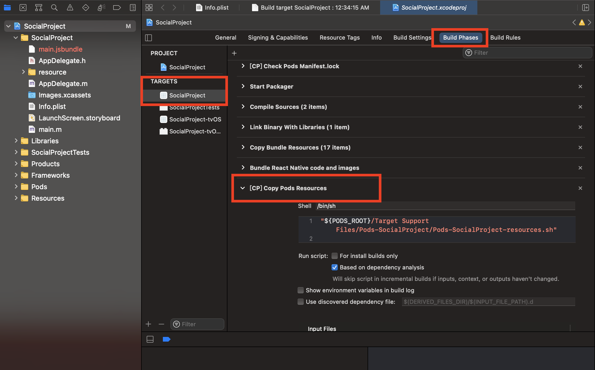
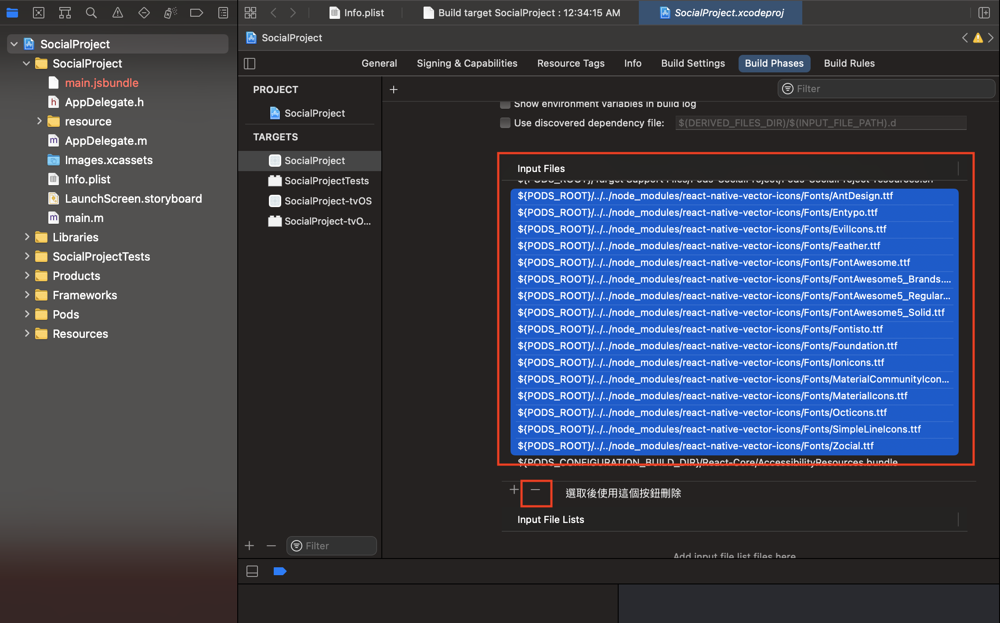
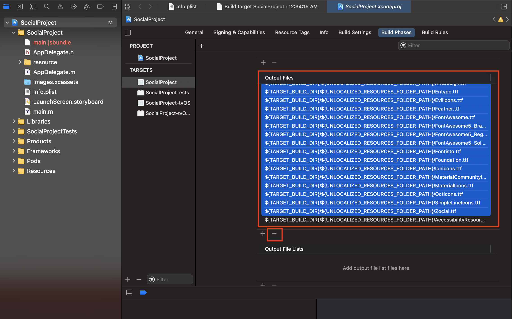
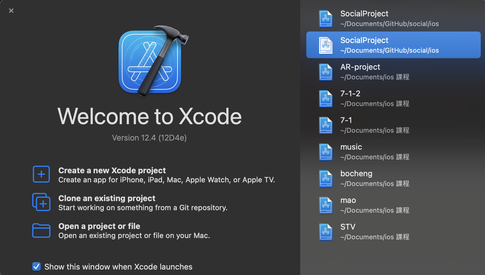
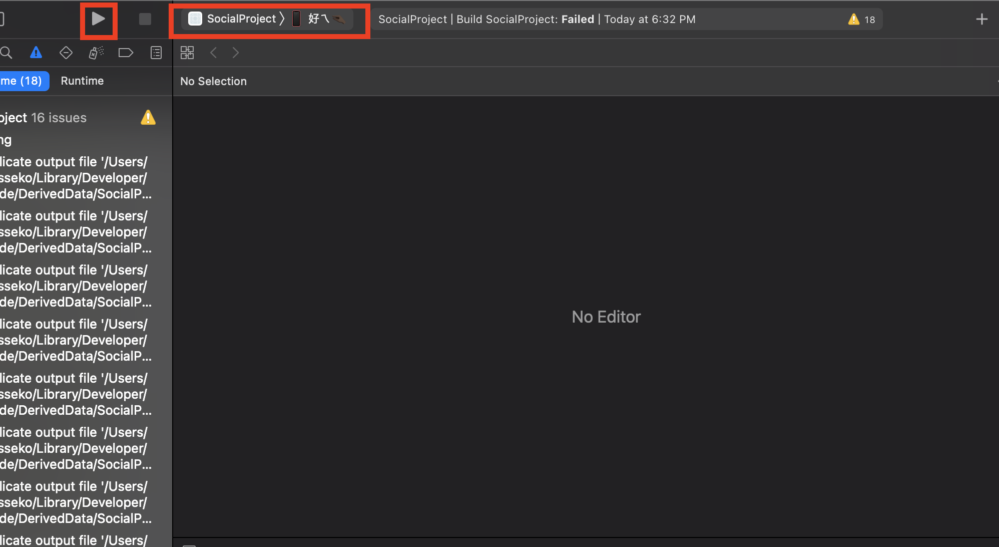

# Jinstagram

---

## 安裝步驟：

1. 將本專案下載下來

    ```jsx
    git clone https://github.com/okesseko/social.git
    ```

以下指令請在 social 這個目錄下執行

 2.安裝相關套件

```jsx
npm install
```

 3.  到 ios 資料夾下並執行 pod install

```jsx
cd ios
pod install
```

如果沒有 pod 請先安裝 cocoapods

```jsx
sudo gem install cocoapods
```

 4.  使用Xcode 打開 iOS 目錄下的 SocialProject.xcodeproj

 5. 刪除 Target中 SocialProject 的 Build Phases 的 [CP] Copy Pods Resources 中的 input和output file 的所有 .ttf 檔案







6. 使用模擬器開啟

```jsx
npm run ios
```

第一次執行需要等待一段時間

如果需要重新刷新 可以在模擬器中使用 command + R 進行重新刷新

7. 使用實體裝置開啟

使用Xcode 開啟 SocialProject.xcworkspace  注意不是 SocialProject.xcodeproj（圖示是白色的那一個）



選擇自己的裝置，按下開始按鈕（第一次燒錄需要特別久）



成功之後就會開啟app （開啟時間需要一段時間 1-3 分鐘，再開啟期間是黑頻或白頻所以請不要關掉，並且需要連接著電腦不可以拔掉）

